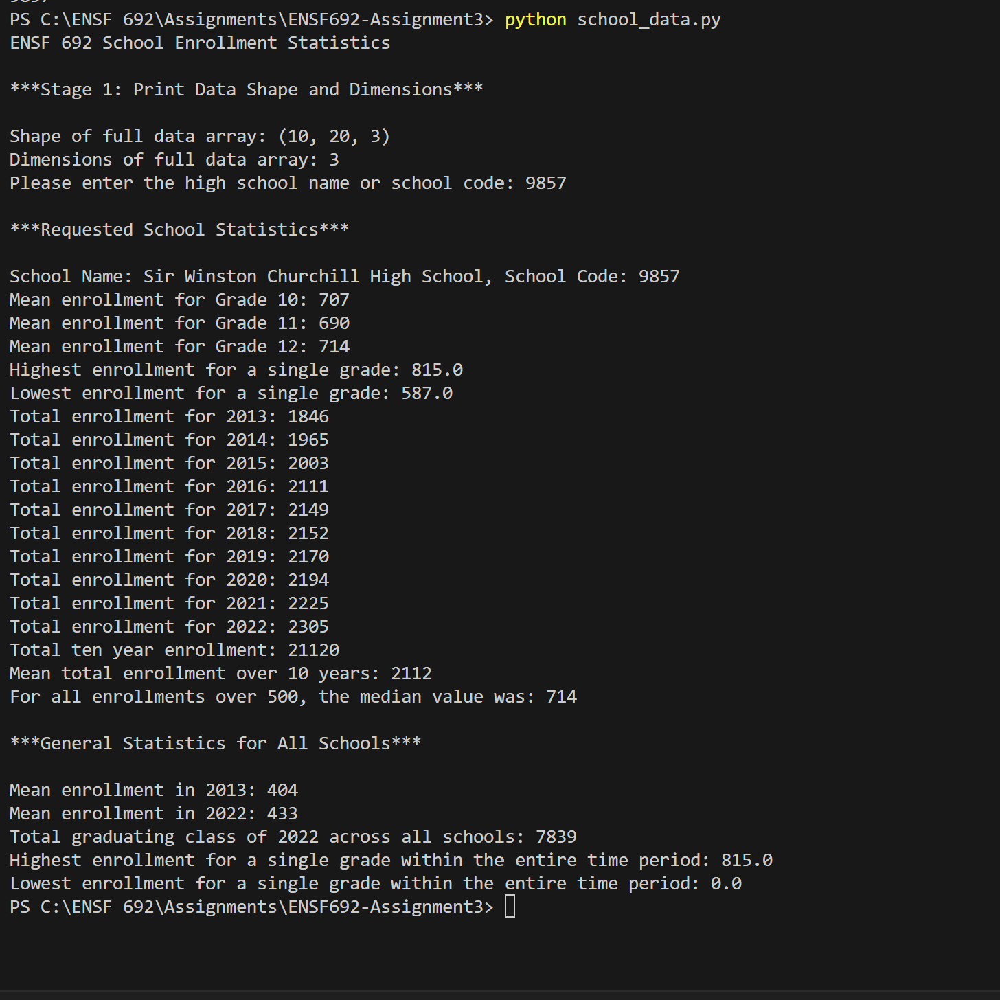

# ENSF692-Assignment3

@Author Alireza Ghasemi
A terminal-based application for computing and printing statistics based on given input.
I acknowlege use of chatgpt to write, debug,learn my code. I did my best to learn what I am provideing as code here.
I added two arrays to the given_data class for school name and school code to be exactly the same as the samople output procided.
--

# Execution Result Screenshot:

